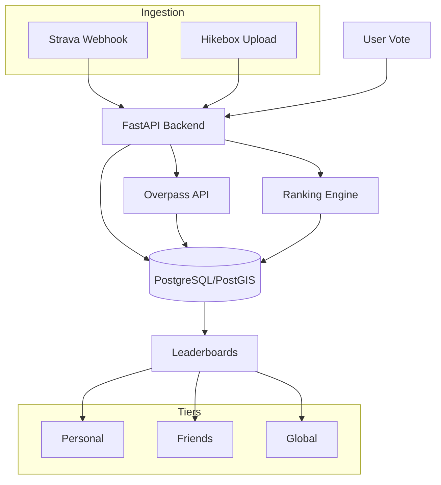

# Cairn: Trail Rankings

Cairn is a social platform for hikers to track Strava activities and rank trails using a Bayesian ranking engine (TrueSkill model). It bridges the gap between variable GPS tracks and static "Canonical Routes" to create definitive leaderboards within social circles.

## Technical Stack

*   **Frontend:** Expo / React Native (TypeScript) - Cross-platform (iOS, Android, Web)
*   **Backend:** FastAPI (Python 3.11)
*   **Database:** PostgreSQL 18 + PostGIS 3.6 (Geospatial indexing)
*   **ORM:** SQLModel (SQLAlchemy-based) + GeoAlchemy2
*   **Tunnels:** Dockerized ngrok for local webhook/OAuth testing
*   **Integration:** Strava API (OAuth2 + Webhooks)
*   **Map Data:** OpenStreetMap (OSM) via Overpass API

## System Architecture



## Core Modules

### 1. Ingestion & Geometry Matching
Cairn automatically identifies which trail a user hiked by comparing their raw GPS stream against "Canonical Routes" seeded from OpenStreetMap.

*   **Multi-Source Ingestion:** Supports activities from Strava (Webhooks) and custom ESP32 "Hikebox" hardware (Manual Upload).
*   **OSM Seeding:** Uses the Overpass API to fetch `route=hiking` relations and ways.
*   **Matching Logic:** Implemented using `Shapely`. The system buffers canonical routes by ~20 meters and calculates the intersection with the user's activity. A match is confirmed if the overlap exceeds 80%.
*   **Automated Enrichment:** New trails are automatically enriched with descriptions from Wikipedia and imagery from Wikimedia Commons during the seeding process, ensuring every discovered route has professional-grade metadata.
*   **Trail Promotion:** For activities with <80% match, users can "promote" their track to a new Canonical Route. The system automatically cleans the track by trimming trailhead noise (default 50m) and simplifying the geometry.

### 2. Ranking Engine
Trails are ranked using a **TrueSkill Bayesian model** that handles sparse 1v1 comparisons with high efficiency. The system tracks both **Quality ($\mu$)** and **Uncertainty ($\sigma$)** for every trail-user pair.

*   **Pairwise Comparisons:** Users calibrate their list by comparing two trails. The system uses **Active Selection** to suggest pairs with the highest "Match Quality" (similar $\mu$, high $\sigma$) to drive convergence as fast as possible.
*   **Dynamic Percentile Bucketing:** Trails are automatically categorized into tiers based on their percentile rank:
    *   **Peak**: Top 25%
    *   **Another Hike**: Middle 50%
    *   **A Hill**: Bottom 25%
*   **Ranking Streams:** 
    *   **Personal Ranking:** Your individual Bayesian hierarchy.
    *   **Friends Ranking:** Social consensus based on friends' $\mu$ scores.
    *   **Global Ranking:** Global community consensus score.

#### Calibration Phase
New users enter a **Calibration Phase** where their personal rankings are only visible once they have ranked at least **5 trails**. This ensures that leaderboards reflect a meaningful baseline of preferences before scores are revealed.

### 3. Social Feed & Engagement
The **Mountain Circle** feed aggregates hiking activities from the user and their followed friends, ordered by **recency of ranking/calibration**.

*   **Ranking Events:** Unlike traditional feeds, Cairn prioritizes trails that have recently been calibrated, showing how different users in the circle value the same trail differently.
*   **Hike Detail Page:** A minimalist, dictionary-style overview for every trail. Accessible from search or the feed, it provides:
    *   Unified view of Personal vs. Circle vs. Global rankings.
    *   High-quality minimalist trail imagery.
    *   A togglable review system for mountain circle vs. global feedback.
    *   Technical metadata (distance, elevation, description).
*   **Public Comments:** To protect user privacy, Strava activity descriptions are treated as private. Users can create a platform-native "Public Comment" during the calibration process (optionally copying from their Strava notes) to share their thoughts with the community.
*   **Rich Metrics:** Captures social stats like kudos (reactions) and comments directly into the feed, while maintaining a strict separation between private logs and public reviews.
*   **Unified Aesthetic:** Both the feed and personal rankings share a premium "Dictionary-Style" card design with defined borders.
*   **Real-Time Sync:** Dashboard refreshes automatically when returning from calibration sessions.
*   **Unified Detail View:** Click trail names from any list (Feed or Rankings) to access the comprehensive detail page.

### 4. Privacy & Data Security
Cairn is built with a "Privacy by Design" philosophy:
*   **JWT Authentication**: All backend endpoints are secured via JWT-based session management.
*   **Restricted Identity**: Client-side `user_id` parameters are eliminated; all identity resolution happens server-side via verified tokens.
*   **Personal Data Isolation**: Strava notes and unranked activities are only visible on your private dashboard and are never exposed to the public or friends feed without explicit promotion.

## UI & Design Philosophy

Cairn follows a premium **"Dictionary-Style"** aesthetic:
*   **Dictionary-Style UI:** Sharp lines, architectural layouts, and a nature-inspired dark mode palette.
*   **Dual Viewports:** Seamlessly toggle between your global "Mountain Circle" feed and your personal "My Rankings" list.
*   **Anchored Comparisons:** To build your hierarchy, new trails are always compared against already-ranked "baseline" trails.
*   **First-Hike Baseline:** Establishing your very first hike as a 10/10 baseline is a one-click process.
*   **Contextual Splash:** Architectural loading screens that define the platform's core philosophy.

## Setup and Installation

### 1. Configure Environment
Copy the `.env.example` file to `.env` and fill in your credentials:
```bash
cp .env.example .env
```

**Frontend Environment:**
Create a `.env` file in the `frontend` directory:
```bash
# frontend/.env
EXPO_PUBLIC_API_URL=https://your-ngrok-url.ngrok-free.dev
```

### 2. Start Services
Ensure Docker is running and execute:

```bash
docker compose up -d
docker compose exec backend alembic upgrade head
```

> [!TIP]
> If you've just pulled changes that updated `backend/requirements.txt`, you should rebuild your backend image to install new dependencies:
> ```bash
> docker compose up -d --build
> ```

### 3. Database Migrations (Alembic)
Cairn uses Alembic for database migrations, providing a workflow similar to Django:

*   **Create a migration** (after changing `models.py`):
    ```bash
    docker compose exec backend alembic revision --autogenerate -m "description of change"
    ```
*   **Apply migrations**:
    ```bash
    docker compose exec backend alembic upgrade head
    ```
*   **Revert last migration**:
    ```bash
    docker compose exec backend alembic downgrade -1
    ```

### 4. Useful Developer Commands
*   **Wipe Rankings:** Reset all comparison history and personal scores for testing:
    ```bash
    docker compose exec backend python -m app.wipe_rankings
    ```

*   **Mock Data Management:** Populate your feed with test activities from Yosemite (Mist Trail, etc.):
    ```bash
    # Attach mock hikes to a specific username
    docker compose exec backend python -m app.manage_mock_data --attach-user <USERNAME>
    
    # Or via User ID
    docker compose exec backend python -m app.manage_mock_data --attach <YOUR_USER_ID>
    ```

*   **Mock Strava Webhooks:** Simulate the end-to-end ingestion flow (creation + matching) without real Strava API calls:
    ```bash
    # Mock a new hike for a user using an existing trail as geometry
    docker compose exec backend python -m app.mock_webhook --username <USERNAME> --route "Mist Trail"
    ```

*   **User Management:** Promote or demote users to admin status:
    ```bash
    # Promote a user to admin
    docker compose exec backend python -m app.manage_users --username <USERNAME> --admin

    # Demote a user from admin
    docker compose exec backend python -m app.manage_users --username <USERNAME> --no-admin
    ```


### 5. Frontend Setup (Mobile & Web)
The app is built with Expo and can be run on iOS, Android, or Web.

```bash
cd frontend
npm install
npm run web  # For browser access
# OR
npx expo start  # Scan QR code with Expo Go on your phone
```

### 3. Seed Trail Data
Populate the database with trails from specific regions. This command now automatically triggers automated enrichment (descriptions from Wikipedia and imagery from Wikimedia Commons):

```bash
# Seed and enrich a park (e.g., yosemite)
docker compose exec backend python -m app.seed_osm --park yosemite

# Or seed a custom bounding box
docker compose exec backend python -m app.seed_osm --bbox "lat_min,lon_min,lat_max,lon_max"
```


## Development and Testing

### Running Tests
The project uses `pytest` with database transaction rollbacks for isolated testing:

```bash
docker compose exec backend pytest
```

### Linting and Formatting
The project uses `ruff` for code quality:

```bash
docker compose exec backend ruff check .
docker compose exec backend ruff format .
```

### API Documentation
Once the stack is running, interactive documentation is available at:
*   Swagger UI: http://localhost:8000/docs
*   Ngrok Dashboard: http://localhost:4040

## Upcoming Roadmap
- [ ] **Mocked Webhook Testing**: Expand `mock_webhook.py` to support full JSON payload simulation via `curl` to the actual `/webhook` endpoint.
- [ ] **Geometry Distortion**: Add more realistic GPS "drift" to mock activities to test matching robustness.
- [ ] **Strava Webhook Signature Verification**: Implement security headers for production webhooks.
