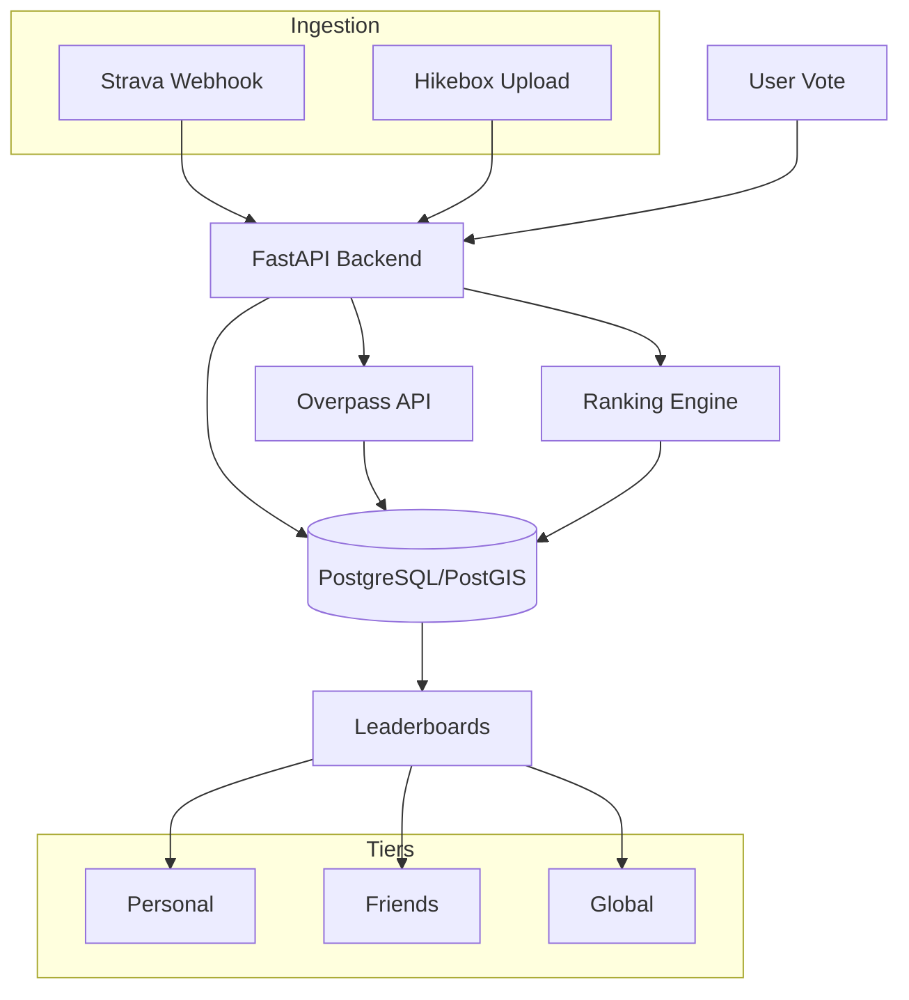

# Cairn: Trail Rankings

Cairn is a social platform for hikers to track Strava activities and rank trails using a Bayesian ranking engine (TrueSkill model). It bridges the gap between variable GPS tracks and static "Canonical Routes" to create definitive leaderboards within social circles.

---

### Documentation
[Overview](README.md) • [Development Setup](DEVELOPMENT.md) • [Contributing](CONTRIBUTING.md)

---

## Technical Stack

*   **Frontend:** Expo / React Native (TypeScript) - Cross-platform (iOS, Android, Web)
*   **Backend:** FastAPI (Python 3.11)
*   **Database:** PostgreSQL 18 + PostGIS 3.6 (Geospatial indexing)
*   **ORM:** SQLModel (SQLAlchemy-based) + GeoAlchemy2
*   **Tunnels:** Dockerized ngrok for local webhook/OAuth testing
*   **Integration:** Strava API (OAuth2 + Webhooks)
*   **Map Data:** OpenStreetMap (OSM) via Overpass API

## System Architecture

## Core Modules

### 1. Ingestion & Geometry Matching
Cairn automatically identifies which trail a user hiked by comparing their raw GPS stream against "Canonical Routes" seeded from OpenStreetMap.

*   **Matching Logic:** Implemented using `Shapely`. The system buffers canonical routes by ~20 meters and calculates the intersection with the user's activity.
*   **Automated Enrichment:** New trails are automatically enriched with descriptions from Wikipedia and imagery from Wikimedia Commons.
*   **Trail Promotion:** For activities with <80% match, users can "promote" their track to a new Canonical Route with automated geometry cleaning.

### 2. Ranking Engine
Trails are ranked using a **TrueSkill Bayesian model** that handles sparse 1v1 comparisons with high efficiency. The system tracks both **Quality ($\mu$)** and **Uncertainty ($\sigma$)**.

*   **Pairwise Comparisons:** Users calibrate their list by comparing two trails. The system uses **Active Selection** to suggest pairs that drive convergence as fast as possible.
*   **Dynamic Percentile Bucketing**: Hikes are categorized into **Peak** (Top 25%), **Another Hike** (Mid 50%), and **A Hill** (Bottom 25%).

### 3. Social Feed & Engagement
The **Mountain Circle** feed aggregates hiking activities from the user and their followed friends, ordered by **recency of ranking/calibration**.

*   **Hike Detail Page**: A minimalist, dictionary-style overview for every trail.
*   **Privacy Isolation**: Strava notes and unranked activities are private by default; users can create platform-native public reviews.

## UI & Design Philosophy

Cairn follows a premium **"Dictionary-Style"** aesthetic:
*   **Architectural Layouts:** Sharp lines and nature-inspired dark mode.
*   **Dual Viewports:** Seamlessly toggle between social feeds and personal rankings.
*   **Contextual Splash:** Loading screens that define the platform's philosophy.

---

**Ready to start?** Head over to the [**Development Guide**](DEVELOPMENT.md) to set up your local environment.
