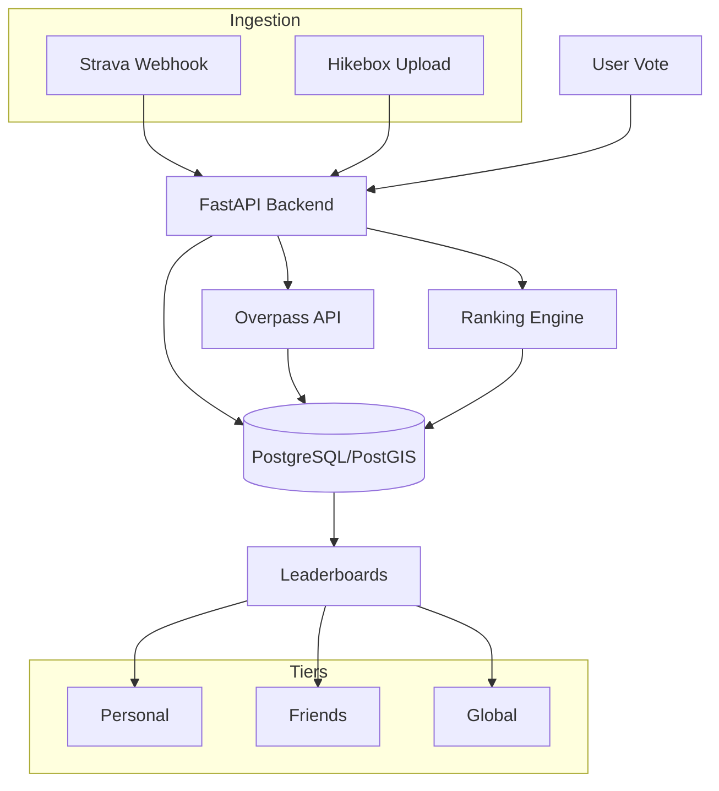
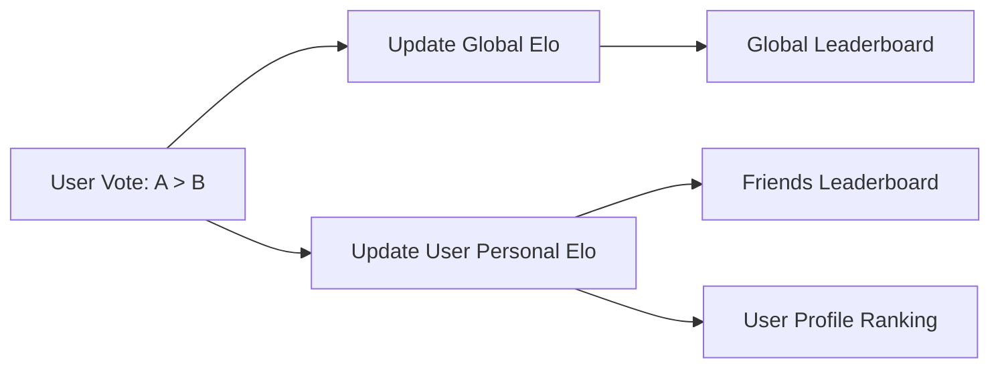

# Cairn: Trail Rankings

Cairn is a social platform for hikers to track Strava activities and rank trails using a pairwise comparison engine (Bradley-Terry model). It bridges the gap between variable GPS tracks and static "Canonical Routes" to create definitive leaderboards within social circles.

## Technical Stack

*   **Backend:** FastAPI (Python 3.11)
*   **Database:** PostgreSQL 18 + PostGIS 3.6 (Geospatial indexing)
*   **ORM:** SQLModel (SQLAlchemy-based) + GeoAlchemy2
*   **Tunnels:** Dockerized ngrok for local webhook/OAuth testing
*   **Integration:** Strava API (OAuth2 + Webhooks)
*   **Map Data:** OpenStreetMap (OSM) via Overpass API

## System Architecture



## Core Modules

### 1. Ingestion & Geometry Matching
Cairn automatically identifies which trail a user hiked by comparing their raw GPS stream against "Canonical Routes" seeded from OpenStreetMap.

*   **Multi-Source Ingestion:** Supports activities from Strava (Webhooks) and custom ESP32 "Hikebox" hardware (Manual Upload).
*   **OSM Seeding:** Uses the Overpass API to fetch `route=hiking` relations and ways.
*   **Matching Logic:** Implemented using `Shapely`. The system buffers canonical routes by ~20 meters and calculates the intersection with the user's activity. A match is confirmed if the overlap exceeds 80%.
*   **Trail Promotion:** For activities with <80% match, users can "promote" their track to a new Canonical Route. The system automatically cleans the track by trimming trailhead noise (default 50m) and simplifying the geometry.

### 2. Ranking Engine
Trails are ranked using a Bradley-Terry model implemented via an Elo-based update system. Every vote updates two distinct streams:

*   **Personal Ranking:** Private to the user, reflecting their individual preferences.
*   **Friends Ranking:** Aggregated scores from people the user follows.
*   **Global Ranking:** A community-wide consensus score stored on the canonical route.



## Setup and Installation

### 1. Configure Environment
Copy the `.env.example` file to `.env` and fill in your credentials:
```bash
cp .env.example .env
```

### 2. Start Services
Ensure Docker is running and execute:

```bash
docker compose up -d
docker compose exec backend python -m app.db_init
```

### 3. Frontend Setup (Mobile & Web)
The app is built with Expo and can be run on iOS, Android, or Web.

```bash
cd frontend
npm install
npm run web  # For browser access
# OR
npx expo start  # Scan QR code with Expo Go on your phone
```

### 3. Seed Trail Data
Populate the database with trails from specific regions:

```bash
# Seed Yosemite National Park
docker compose exec backend python -m app.seed_osm --park yosemite

# Seed by bounding box
docker compose exec backend python -m app.seed_osm --bbox "37.70,-122.55,37.85,-122.35"
```

## Development and Testing

### Running Tests
The project uses `pytest` with database transaction rollbacks for isolated testing:

```bash
docker compose exec backend pytest
```

### Linting and Formatting
The project uses `ruff` for code quality:

```bash
docker compose exec backend ruff check .
docker compose exec backend ruff format .
```

### API Documentation
Once the stack is running, interactive documentation is available at:
*   Swagger UI: http://localhost:8000/docs
*   Ngrok Dashboard: http://localhost:4040
